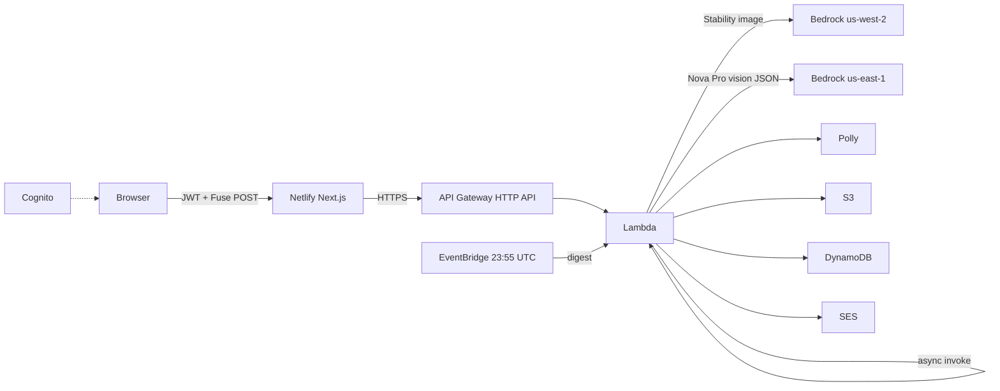

Weekend Creative Challenge: Infinite Mashup Studio

#creative-expression

## Title

Weekend Creative Challenge: Infinite Mashup Studio

## Tag

#creative-expression

## Vision

The vision is a shared creative ritual, not another “type a prompt, get a paragraph” demo. I wanted a studio where the player’s job is to choose ingredients, not to write the story. Constraint is the point: a daily locked trio, a finite catalog, at most two extra chips, or a sandbox with two photos. The machine’s job is invention — one creature, object, or concept that should not exist, painted as a real illustration, then documented like a museum piece.

I also wanted the same daily board for everyone on Earth on a given UTC date, so the challenge feels communal, while accounts keep each person’s gallery private. The app should fail honestly if art cannot be generated. Clip-art fallbacks would have violated the vision.

## What the app does

Infinite Mashup Studio is a Next.js studio in the browser backed by AWS Lambda and Bedrock.

Daily challenge: three ingredients are locked from a date seed. You may add up to two more from the catalog (animals, foods, places, tools, myths, and so on). Sandbox: pick two to five catalog items, and optionally attach up to two photos from the device camera or a file upload.

Fuse starts an async job. The worker generates one cinematic illustration, then Amazon Nova Pro reads that PNG and returns a JSON dossier that must match the image. The result page shows the art plus eight cards: origin story, abilities, personality, fun facts, advertisement, warning label, scientific classification, and mock patent. Polly reads the origin aloud. Translate can localize the dossier. Remix, share, download, copy, and delete are on the result.

Signed-out visitors hit a login panel (header is brand-only). After sign-in they get a private gallery (Today / All time for that account only), a ten-mashup UTC daily cap, in-browser notifications when Fuse finishes, and optional SES mail plus a 23:55 UTC digest. Sign out returns to the login panel. Gallery lists are not public.

## How you built it

### Development process

I built the UI first as a studio table (chips, catalog, Fuse, result reveal) in Next.js 15, TypeScript, Tailwind, and Framer Motion. The backend is one SAM stack in us-east-1: HTTP API, one Python 3.12 Lambda, DynamoDB, S3. Fuse is never a single blocking HTTP call. POST `/fuse` writes `JOB#PENDING`, Lambda invokes itself with `InvocationType=Event`, and the browser polls `/jobs/{id}` until `COMPLETE` or `FAILED`.

```text
Browser  --POST /fuse-->  API Gateway  -->  Lambda start_job
                                              | put JOB#PENDING
                                              | invoke Event
                                              v
                                         Lambda worker
                                              | paint image
                                              | Nova reads image -> JSON
                                              | Polly MP3
                                              | put S3 png/mp3/json
                                              | put MASHUP# + GSIs
                                              v
Browser  --GET /jobs/{id}-->  COMPLETE + mashupId  -->  /m/{id}
```

Sandbox photos are compressed on the client (JPEG, max 1280px), stored at `jobs/{jobId}/photo-N.jpg`, then used for Stability image-to-image or a Nova vision prompt before text-to-image.

The frontend host started on Amplify, then moved to Netlify after env-var and gallery bugs. Bedrock, DynamoDB, and S3 never moved.

### Key decisions

1. **Catalog allowlist, not a textarea.** Lambda rejects unknown ingredient IDs. That is gameplay and prompt-injection control.
2. **Pixels before prose.** Nova Pro’s Converse call includes the generated PNG. The dossier is not allowed to describe a different invention than the art.
3. **UTC date seed for the daily trio.** Identical chips worldwide without a config table.
4. **Cognito for ownership.** JWT `sub` is stored as `userId`. Gallery and the daily cap query `USER#{sub}`, not a global scan.
5. **No fake images.** If Stability (and fallbacks) fail, the job fails in the UI.
6. **Netlify for UI, AWS for Fuse.** The browser never receives Bedrock keys. Next.js `/api/*` routes proxy to API Gateway.

### Challenges encountered, and how they were overcome

**Nova Canvas and Titan Image were blocked** on this account (`InvokeModel` end-of-life / unused legacy). Stability AI models in **us-west-2** worked. The us-east-1 Lambda uses a second client, `bedrock_west`, and tries Ultra, then SD 3.5 Large, then Core. Gemini image was a last resort; it 429’d on depleted prepaid credits.

**Sandbox rows disappeared from Today** because `gsi1pk` was `DATE#sandbox`. The worker now always writes `DATE#{UTC date}` and keeps `mode` separately.

**The gallery listed everyone’s mashups.** It now returns `[]` without a valid user, and `byUser` when signed in.

**The “10 left” counter was wrong** when quota keys and mashup rows disagreed. The cap now counts that user’s mashups created on the UTC day.

**SES mail from a Gmail address through Amazon fails Gmail DMARC.** Templates were improved; a custom domain with SPF/DKIM is still required for reliable inbox placement. Browser notifications still work.

**Amplify did not inject `FUSE_API_URL` into Next route handlers.** Netlify hosts the UI; the API stays on API Gateway. Windows Netlify CLI failed renaming `.next`; Linux Docker deploys succeeded.

## AWS services used

| AWS service | What it does in this app |
|---|---|
| Amazon API Gateway HTTP API | POST `/fuse`, GET `/jobs/{id}`, GET `/mashups/{id}`, DELETE `/mashups/{id}`, GET `/gallery`, GET `/quota`, GET `/translate` |
| AWS Lambda | Job start + 180s worker (image, JSON, audio, S3, DynamoDB, mail) |
| Amazon DynamoDB | Jobs, mashups, TTL rate keys, `USER#` profiles, GSIs |
| Amazon S3 | `mashups/{id}.png`, `.mp3`, `.json`; job photos |
| Amazon Bedrock | Nova Pro vision JSON (us-east-1); Stability image (us-west-2) |
| Amazon Polly | Neural voice Ruth, origin narration |
| Amazon Translate | Dossier localization |
| Amazon Cognito | Email user pool, USER_PASSWORD_AUTH |
| Amazon SES | Ready-mail and daily digest |
| Amazon EventBridge | `cron(55 23 * * ? *)` digest invoke |
| AWS SAM / CloudFormation | Stack `infinite-mashup-studio` |
| IAM | Bedrock, Polly, Translate, SES, Cognito GetUser, S3, DynamoDB, `lambda:InvokeFunction` |

Non-AWS: Next.js 15 on Netlify for the UI only.

## Architecture overview

```text
                         +------------------+
                         |  Cognito pool    |
                         |  email + JWT     |
                         +--------+---------+
                                  ^
                                  | sign-in
+-------------+     +-------------+--------------+      +------------------+
|  Browser    |     |  Netlify (Next.js 15)      |      |  API Gateway     |
|  Studio UI  +---->+  /api/fuse gallery quota   +----->+  HTTP API        |
+-------------+     +----------------------------+      +--------+---------+
                                                                   |
                                                                   v
                                                        +----------+-----------+
                                                        |  Lambda fuse worker  |
                                                        +--+-----+----+---+----+
                                                           |     |    |   |
                     us-west-2 Bedrock                     |     |    |   |
                     Stability Ultra/Core/SD3.5  <---------+     |    |   |
                                                                |    |   |
                     us-east-1 Nova Pro Converse <---------------+    |   |
                     (PNG in, JSON dossier out)                       |   |
                                                                      |   |
                     Polly neural  -----------------------------------+   |
                                                                          |
                     S3 + DynamoDB + SES + EventBridge  <-----------------+
```



Image generation:

```python
for model_id in (
    "stability.stable-image-ultra-v1:1",
    "stability.sd3-5-large-v1:0",
    "stability.stable-image-core-v1:1",
):
    response = bedrock_west.invoke_model(
        modelId=model_id,
        body=stability_body,
        accept="application/json",
        contentType="application/json",
    )
```

Story from the image:

```python
result = bedrock.converse(
    modelId=TEXT_MODEL,
    system=[{"text": SYSTEM}],
    messages=[{
        "role": "user",
        "content": [
            {"image": {"format": "png", "source": {"bytes": png}}},
            {"text": prompt},
        ],
    }],
)
```

DynamoDB item shape:

```text
pk      = MASHUP#{uuid}
gsi1pk  = DATE#{YYYY-MM-DD}
gsi1sk  = createdAt
gsi2pk  = DATE#ALL
gsi2sk  = createdAt
gsi3pk  = USER#{cognito-sub}
gsi3sk  = createdAt
```

## What you learned

Bedrock is two jobs: Converse (vision + structured JSON) and InvokeModel (Stability image JSON in another region). Assuming Nova Canvas still works wasted real time.

Async self-invoke plus a job row is how you tell the truth about 30–90 second generation without blowing API Gateway timeouts.

GSIs are product: `DATE#sandbox` vs `DATE#2026-08-14`, and `USER#{sub}` vs a public scan.

The UI host can change without moving the model plane. Amplify vs Netlify was an env and OS problem, not a Bedrock problem.

Cognito JWTs are enough to own rows; they are not a replacement for IAM on Bedrock.

SES + Gmail-as-From will spam. Notifications in the browser still delivered the “generation done” moment.

Creatively: constrain inputs (chips, two photos, allowlists), then let the models go wide on one invention. The player does not author the origin story. They pick ingredients. The studio invents.

## Link to app or repo

Working deployed app: https://infinite-mashup-studio.netlify.app

Public GitHub repository: https://github.com/sivaabishikth2025-byte/infinite-mashup-studio

Fuse API (AWS): https://1gp21rrv70.execute-api.us-east-1.amazonaws.com  
CloudFormation stack: `infinite-mashup-studio` (us-east-1)
