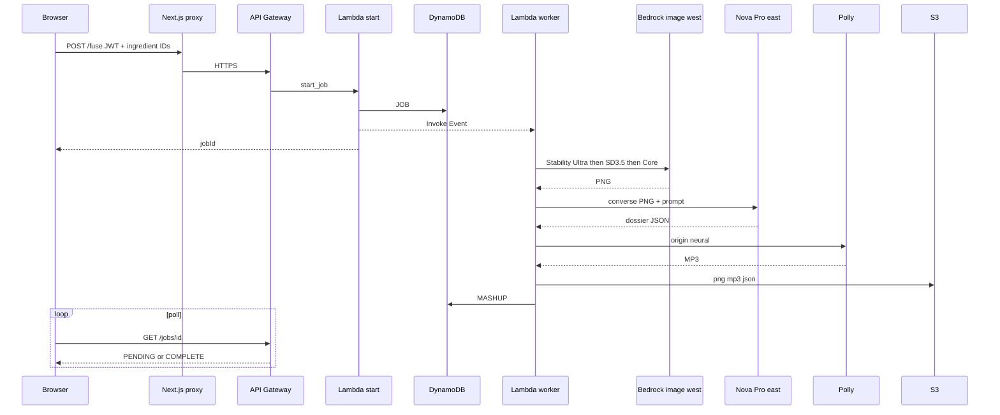
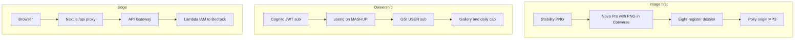
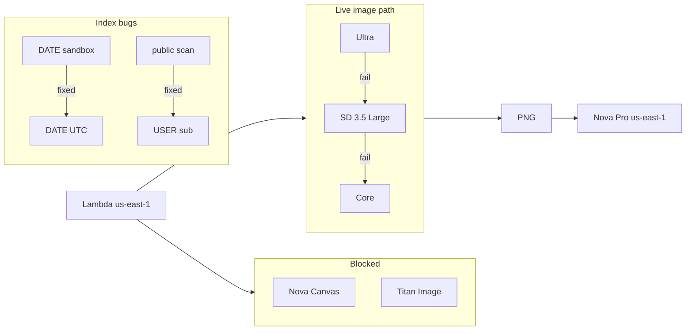
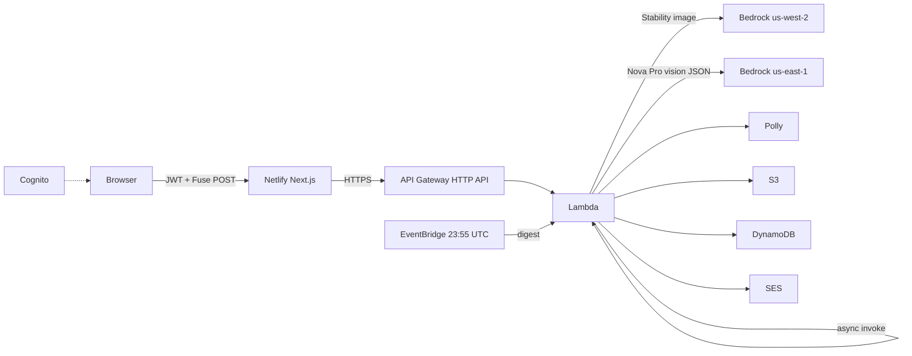

Weekend Creative Challenge: Infinite Mashup Studio

#creative-expression

## Title

Weekend Creative Challenge: Infinite Mashup Studio

## Tag

#creative-expression

## Vision

I did not want another prompt box that dumps a paragraph. I wanted a studio where authorship is selection, not typing. You commit to a small set of ingredients; the system has to invent a single thing that could not exist without that collision — then treat that thing as if it already had a history, a body, and a paper trail.

Constraint is the mechanism. A daily locked trio (UTC date seed, identical worldwide) makes the dare communal: the same three chips, different fusions. A catalog allowlist stops the session from collapsing into whatever prompt is trending. Sandbox exists for a different kind of authorship — you bring your own mix, including up to two photographs — without turning the product into an unrestricted image chatbot.

The other half of the vision is integrity of the artifact. If Bedrock cannot produce a real illustration, the job fails. SVG clip-art, collage placeholders, and “success” cards with dummy art would have been a different app. Words come after pixels: Nova Pro is given the PNG and must describe that image, not a parallel fantasy.

Identity is part of the vision, not a bolt-on. The daily board is public knowledge; the inventions are not. Cognito-backed private galleries, a hard ten fuses per UTC day, and sign-out back to login keep the studio from becoming a dump of everyone else’s creatures. Shared constraint, private output.

## What the app does

**Purpose of the app.** Infinite Mashup Studio exists so someone can invent a thing that should not exist by choosing ingredients, not by writing a prompt. Daily challenge gives everyone the same three locked ingredients for that UTC date, with room for two more from the catalog. Sandbox is the private version of the same act: two to five ingredients you pick, and if you want, up to two photographs from the camera or an upload so a real object or sketch can enter the mix. Fuse is the creative verb: those ingredients become one creature, object, or concept. Remix is a second pass on a related mix. The purpose is invention under constraint — a shared daily dare, or an open table — and a finished piece you can keep, hear, and show.

**Creative output it produces.** Each fuse yields one mashup as a finished creative work:

The centerpiece is an original illustration of that invention: a single cinematic image of the fused subject, not the ingredients sitting next to each other.

Around that image is a written world for the same invention, in several registers: an origin story; what it can do; how it behaves; short facts; a mock advertisement; a warning label; a scientific classification; a mock patent. The writing is meant to read as if the thing already existed — myth, character, satire, hazard copy, taxonomy, and a fake legal claim — all about the picture on screen.

The origin is also produced as spoken audio, so the piece has a voice. The writing can be translated so the same invention can be read in another language without changing the art. Remix produces a new illustration and a new body of writing, a second work rather than a tweak of the first.

That is the output the challenge is asking about: a mashup image, a multi-register story world, and a reading of the origin — one invented thing, fully dressed.

## How you built it

### Development process

The product was built as two planes that never mixed credentials. The studio UI (Next.js 15, TypeScript, Tailwind, Framer Motion) is composition: catalog chips, daily seed, sandbox photos, Fuse, result. The generative plane is one SAM stack in us-east-1 — HTTP API, a single Python 3.12 Lambda, DynamoDB, S3 — because image + vision JSON + Polly does not fit inside an API Gateway timeout. The HTTP contract is therefore a job, not a response body.

Start_job authenticates, validates catalog IDs, writes `JOB#PENDING`, and invokes the same function with `InvocationType=Event`. The worker is a linear pipeline: optional photo objects at `jobs/{id}/photo-N.jpg`, Stability PNG, Nova Pro with that PNG in Converse, Polly on the origin, then S3 (`mashups/{id}.png|.mp3|.json`) and `MASHUP#` plus GSIs. The browser polls `/jobs/{id}` until `COMPLETE` and routes to `/m/{id}`. The UI host moved Amplify → Netlify; the SAM stack did not move with it.

```text
                    compose (chips / photos)
                              |
                              v
Browser --POST /fuse--> API GW --> Lambda start_job
                                      | put JOB#PENDING
                                      | Event invoke
                                      v
                                 Lambda worker
                    +-------------+-------------+
                    |  PNG (west) | JSON (east) |
                    |  Polly MP3  | S3 + DDB    |
                    +-------------+-------------+
                                      |
Browser <--GET /jobs/{id}-- COMPLETE --+--> /m/{id}
```



Diagram image (upload in Builder Center if mermaid does not render): `article-assets/how-built-fuse-pipeline.png`

### Key decisions

**Allowlist on the wire.** The Lambda never accepts free-text ingredients. Unknown IDs 400. That is the game design and the injection boundary in one check.

**Pixels before prose.** The dossier is not a second imaginative pass. Nova Pro’s user message contains the PNG bytes. If the image is a frog-violin chimera, the origin cannot describe a typewriter golem. Failed image gen fails the job; there is no decorative stand-in.

**UTC seed, not a config table.** Daily trio is `hash(UTC date) → catalog`. Same chips worldwide without an admin row.

**Ownership is `sub`, not “latest items.”** `userId` and GSI `USER#{cognito-sub}` are the gallery and the daily cap. `DATE#ALL` is not a public feed.

**Keys stay on AWS.** Next.js `/api/*` is a proxy. The browser holds a Cognito JWT, not Bedrock credentials.

```text
  [chips] --IDs only--> Lambda --reject unknown-->
  [photos] --> S3 job prefix --> image-to-image / vision prompt
       |
       v
  PNG ------------------+
                        |  converse(image + text)
                        v
                   dossier JSON --> Polly origin
                        |
                        v
              MASHUP#  gsi3 = USER#{sub}
```



Diagram image: `article-assets/how-built-pixels-before-prose.png`

### Challenges encountered, and how they were overcome

**Canvas / Titan dead on the account.** `InvokeModel` for Nova Canvas and Titan Image returned EOL / unused-legacy. The worker grew a second client, `bedrock_west`, and a fallback chain in us-west-2: `stability.stable-image-ultra-v1:1` → `stability.sd3-5-large-v1:0` → `stability.stable-image-core-v1:1`. Gemini image was a last resort and 429’d on depleted prepaid credits, so it is not on the live path. Nova Pro stayed in us-east-1 and still sees the PNG.

**Wrong partition key hid sandbox.** `gsi1pk = DATE#sandbox` meant Today could not see sandbox fuses. Index is always `DATE#{UTC date}`; `mode` is an attribute.

**Gallery was a global scan.** Unsigned list now returns empty; signed-in list is `byUser` only.

**Quota drifted from reality.** A separate `QUOTA#` counter disagreed with rows. The cap is now a count of that `sub`’s mashups whose `createdAt` is the UTC day.

**SES From Gmail fails Gmail DMARC.** Completion still has to land: browser Notification API. Inbox needs a domain + SPF/DKIM; that is unfinished, not faked.

**Amplify dropped `FUSE_API_URL` in route handlers.** UI moved to Netlify. Windows `netlify deploy` failed renaming `.next`; Linux Docker deploys are the release path.

```text
  us-east-1 Lambda
       |  Canvas X   Titan X
       |  Nova Pro converse  (PNG in)  OK
       v
  bedrock_west  us-west-2
       Ultra --fail--> SD 3.5 Large --fail--> Core --fail--> job FAILED

  gsi1  DATE#sandbox  X  -->  DATE#YYYY-MM-DD  +  attr mode
  gallery  DATE#ALL public  X  -->  USER#{sub} or []
```



Diagram image: `article-assets/how-built-challenges.png`

## AWS services used

| Service | Role |
|---|---|
| Amazon API Gateway HTTP API | `/fuse`, `/jobs/{id}`, `/mashups/{id}`, `/gallery`, `/quota`, `/translate` |
| AWS Lambda | Start job + ~180s worker (image, JSON, audio, persistence, mail) |
| Amazon DynamoDB | Jobs, mashups, TTL rate keys, profiles; GSIs `byDate`, `byAll`, `byUser` |
| Amazon S3 | `mashups/{id}.png`, `.mp3`, `.json`; job photos |
| Amazon Bedrock | Stability image (us-west-2); Nova Pro vision JSON (us-east-1) |
| Amazon Polly | Origin narration (Ruth, neural) |
| Amazon Translate | Dossier localization |
| Amazon Cognito | Email pool, `USER_PASSWORD_AUTH` |
| Amazon SES | Ready-mail, digest |
| Amazon EventBridge | `cron(55 23 * * ? *)` digest |
| AWS SAM / CloudFormation | Stack `infinite-mashup-studio` |
| IAM | Bedrock, Polly, Translate, SES, Cognito GetUser, S3, DynamoDB, `lambda:InvokeFunction` |

UI only: Next.js 15 on Netlify.

## Architecture overview

Full-system diagram (upload this in Builder Center): `article-assets/infinite-mashup-studio-full-architecture.png`

```text
Browser (Cognito JWT)
  -> Netlify Next.js /api/*
  -> API Gateway HTTP API
  -> Lambda (sync start, async worker)
       -> Bedrock us-west-2 Stability (PNG)
       -> Bedrock us-east-1 Nova Pro (PNG -> JSON)
       -> Polly, S3, DynamoDB, SES
EventBridge 23:55 UTC -> Lambda digest
```



```python
for model_id in (
    "stability.stable-image-ultra-v1:1",
    "stability.sd3-5-large-v1:0",
    "stability.stable-image-core-v1:1",
):
    response = bedrock_west.invoke_model(
        modelId=model_id,
        body=stability_body,
        accept="application/json",
        contentType="application/json",
    )
```

```python
result = bedrock.converse(
    modelId=TEXT_MODEL,
    system=[{"text": SYSTEM}],
    messages=[{
        "role": "user",
        "content": [
            {"image": {"format": "png", "source": {"bytes": png}}},
            {"text": prompt},
        ],
    }],
)
```

```text
pk      = MASHUP#{uuid}
gsi1pk  = DATE#{YYYY-MM-DD}
gsi1sk  = createdAt
gsi2pk  = DATE#ALL
gsi2sk  = createdAt
gsi3pk  = USER#{cognito-sub}
gsi3sk  = createdAt
```

## What you learned

The useful lessons were about where generative work actually lives in an AWS system, not about wiring a hello-world Lambda.

Bedrock is a capability surface with regional and product gaps, not a single “generate” switch. Image and language are different contracts (`InvokeModel` vs `converse`), different regions, and different failure modes. Grounding language in the PNG is an architectural choice: the creative object is one invention, so vision-conditioned JSON is how you keep lore and pixels as the same work. Fallback chains (Ultra → SD 3.5 → Core) are product reliability, not a model bake-off.

Long-running synthesis does not belong on a synchronous HTTP deadline. Treating Fuse as a job — persist pending, async self-invoke, poll to complete — is how you tell the truth about generation time and still use API Gateway. The UI is a client of that state machine, not a place that waits on Bedrock.

Access patterns are the product. Partition keys decide whether Today, sandbox, and a private gallery even exist. A GSI that encodes mode instead of calendar date hides work. A GSI that encodes “everyone” is a different application than one that encodes `sub`. A quota that is not derived from the same rows as the gallery will disagree with the user.

Identity and authorization split cleanly: Cognito is who owns a mashup; IAM is who may call Bedrock, Polly, S3, and DynamoDB. Putting model keys in the browser would have collapsed that split. Hosting the Next.js shell on Netlify while leaving the SAM stack in us-east-1 made the same point at the edge: the creative plane is independent of which CDN serves the studio.

Delivery of “your piece is ready” is a product constraint. Email from an unverified consumer mailbox through SES loses to DMARC; the completion signal still has to exist in-session. Constraint on the input side is the other half: an allowlisted catalog and a daily seed are how you get shared creative ritual without turning the backend into an open prompt endpoint.

What I would take into the next build is that same shape — jobed multimodal pipeline, vision-bound structured output, identity-scoped indexes, and a UI that only composes — rather than a larger model list.

## Link to app or repo

Working app: https://infinite-mashup-studio.netlify.app

Public repo: https://github.com/sivaabishikth2025-byte/infinite-mashup-studio

API: https://1gp21rrv70.execute-api.us-east-1.amazonaws.com  
Stack: `infinite-mashup-studio` (us-east-1)
