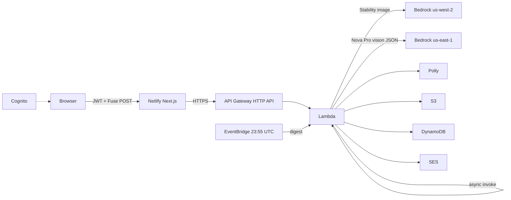

Weekend Creative Challenge: Infinite Mashup Studio

#creative-expression

## Vision & what the app does

Infinite Mashup Studio is a creative game, not a chatbot. There is no empty prompt box asking you to “describe anything.” The product is a studio table: a daily locked trio of ingredients, a searchable catalog, an optional sandbox with camera and photo upload, one Fuse button, and a result that looks like concept art plus a dossier.

Every UTC day the app seeds three ingredients for everyone — frog, violin, and typewriter, or whatever the date hash decides. You can add up to two more from the catalog, then Fuse. In sandbox you pick two to five catalog ingredients, or mix in up to two photos from the camera or an upload. The backend does not collage clip-art. It generates a real illustration, then Amazon Nova Pro looks at that image and writes a structured invention that matches the pixels.

The creative output is one original mashup that should not exist: a name, tagline, origin story, abilities, personality, fun facts, a ridiculous advertisement, a warning label, scientific classification, and a mock patent. Amazon Polly narrates the origin. Amazon Translate can rewrite the dossier. You can remix, share, download the art, copy the story, or delete it from your private gallery.

Accounts exist so the gallery is personal. Signed out, the public URL is a login panel. Signed in, you get ten fuses per UTC day, a browser notification when generation finishes, optional email when the mashup is ready, and an end-of-day recap of what you fused. Sign out returns to login. Nobody else sees your gallery list.

Live app: https://infinite-mashup-studio.netlify.app  
Source: https://github.com/sivaabishikth2025-byte/infinite-mashup-studio

## How you built it

I started from a Next.js 15 App Router UI (TypeScript, Tailwind, Framer Motion) and a single AWS SAM stack in us-east-1. The first product rule was no fake mashups. If image generation failed, the job failed in the UI. A silent SVG fallback would have been a dishonest challenge entry.

The Fuse path is asynchronous on purpose. Bedrock image generation plus Nova vision plus Polly does not fit a polite 29-second HTTP timeout. The browser POSTs `/fuse`, Lambda stores a `JOB#` record in DynamoDB, then asynchronously invokes itself as a worker. The UI polls `/jobs/{id}` until `COMPLETE` or `FAILED`.

```text
Browser  --POST /fuse-->  API Gateway  -->  Lambda start_job
                                              | put JOB#PENDING
                                              | invoke Event
                                              v
                                         Lambda worker
                                              | paint image
                                              | Nova reads image -> JSON
                                              | Polly MP3
                                              | put S3 png/mp3/json
                                              | put MASHUP# + GSIs
                                              v
Browser  --GET /jobs/{id}-->  COMPLETE + mashupId  -->  /m/{id}
```

Key decisions:

1. **Catalog, not free text.** Ingredient IDs are allowlisted in Lambda. That keeps the game on-theme and blocks prompt injection through a textarea.
2. **Image first, story second.** Nova Pro receives the generated PNG and must describe that scene. The dossier cannot invent a different creature than the art.
3. **Date seed for the daily trio.** The same UTC date produces the same three locked chips worldwide without a “daily config” table.
4. **Auth for ownership, not for Bedrock.** Cognito email/password lives in the browser. Lambda reads the access/id token, stores `userId` on the mashup, and queries a `byUser` GSI for gallery and the daily cap.
5. **Host the UI where it deploys cleanly.** Amplify Hosting ran the Next.js app but environment variables for `FUSE_API_URL` did not reach route handlers, so the gallery showed “not configured.” I moved the frontend to Netlify. The Fuse API stayed on API Gateway + Lambda.

Challenges and how they were fixed:

**Nova Canvas and Titan Image were blocked.** On this account `InvokeModel` for Nova Canvas and Titan Image G1 v2 returned end-of-life / unused-legacy errors. Stability AI image models in **us-west-2** worked (`stability.stable-image-ultra-v1:1`, then SD 3.5 Large, then Core). The Lambda in us-east-1 creates a second Bedrock client for `us-west-2` only for paint. Gemini image was wired as a last resort; prepaid credits there returned 429, so it is not the happy path.

**Sandbox mashups vanished from “Today”.** Early records used `gsi1pk = DATE#sandbox`. The gallery queried `DATE#{utc-date}`, so sandbox work only appeared in All time. The worker now always indexes `gsi1pk = DATE#{UTC day}` and keeps `mode` as a separate field. The gallery itself later became private per account, so Today/All time filter that user’s mashups.

**Gallery was accidentally public.** The first version listed every mashup on earth. The product requirement is per-user. Unsigned requests now get an empty list. Signed-in queries hit `gsi3pk = USER#{sub}`.

**Daily count lied.** A separate `QUOTA#` counter could desync from real jobs (especially if auth headers were stripped). The cap now counts mashups created today on that Cognito `sub`: ten complete inventions per UTC day.

**Email landed in spam.** SES was sending `From: you@gmail.com` through Amazon. Gmail’s DMARC alignment fails in that setup. The transactional templates were cleaned up, but inbox placement for Gmail-as-From still needs a domain you control with SPF/DKIM. Browser notifications still fire when Fuse completes.

**Netlify vs Amplify.** Local Windows deploys of `@netlify/plugin-nextjs` failed while renaming `.next` (“Failed publishing static content”). Linux Docker builds of the same repo published cleanly to https://infinite-mashup-studio.netlify.app.

Camera and upload in sandbox compress JPEGs on the client (max 1280px, quality ~0.72), store them on S3 under `jobs/{id}/`, then the worker either image-to-images the first photo or asks Nova to write a fusion prompt from both photos plus catalog labels.

## AWS services used / architecture overview

| Service | Role |
|---|---|
| Amazon API Gateway HTTP API | Public routes: POST `/fuse`, GET `/jobs/{id}`, GET `/mashups/{id}`, DELETE `/mashups/{id}`, GET `/gallery`, GET `/quota`, GET `/translate` |
| AWS Lambda (Python 3.12, 1024 MB, 180s) | Sync job start + async worker: image, dossier, audio, persistence, mail, digest |
| Amazon DynamoDB | Jobs, mashups, rate keys, user profiles, GSIs `byDate`, `byAll`, `byUser` |
| Amazon S3 | Public `mashups/{id}.png`, `.mp3`, `.json`; private job photos |
| Amazon Bedrock | Nova Pro (`amazon.nova-pro-v1:0`) Converse with image; Stability image models in us-west-2 |
| Amazon Polly | Neural voice Ruth reads origin + tagline |
| Amazon Translate | On-demand dossier localization |
| Amazon Cognito | User pool, email as username, USER_PASSWORD_AUTH from the browser |
| Amazon SES | Completion mail + 23:55 UTC EventBridge digest |
| Amazon EventBridge | Scheduled `{"digest": true}` invoke |
| AWS SAM / CloudFormation | Single stack `infinite-mashup-studio` in us-east-1 |
| IAM | Lambda may invoke Bedrock, Polly, Translate, SES, Cognito GetUser, S3, DynamoDB, self-invoke |

The Next.js UI is hosted on Netlify. It never holds Bedrock credentials. Server routes proxy to the HTTP API and forward `Authorization`, `x-id-token`, and `x-ims-access`.

```text
                         +------------------+
                         |  Cognito pool    |
                         |  email + JWT     |
                         +--------+---------+
                                  ^
                                  | sign-in
+-------------+     +-------------+--------------+      +------------------+
|  Browser    |     |  Netlify (Next.js 15)      |      |  API Gateway     |
|  Studio UI  +---->+  /api/fuse gallery quota   +----->+  HTTP API        |
+-------------+     +----------------------------+      +--------+---------+
                                                                   |
                                                                   v
                                                        +----------+-----------+
                                                        |  Lambda fuse worker  |
                                                        +--+-----+----+---+----+
                                                           |     |    |   |
                     us-west-2 Bedrock                     |     |    |   |
                     Stability Ultra/Core/SD3.5  <---------+     |    |   |
                                                                |    |   |
                     us-east-1 Nova Pro Converse <---------------+    |   |
                     (PNG in, JSON dossier out)                       |   |
                                                                      |   |
                     Polly neural  -----------------------------------+   |
                                                                          |
                     S3 bucket  <-----------------------------------------+
                     DynamoDB table  <------------------------------------+
                     SES + EventBridge digest  <--------------------------+
```

Mermaid equivalent:



Worker paint order (real code path):

```python
for model_id in (
    "stability.stable-image-ultra-v1:1",
    "stability.sd3-5-large-v1:0",
    "stability.stable-image-core-v1:1",
):
    response = bedrock_west.invoke_model(
        modelId=model_id,
        body=stability_body,
        accept="application/json",
        contentType="application/json",
    )
```

After a PNG exists, Nova Pro must treat the picture as canon:

```python
result = bedrock.converse(
    modelId=TEXT_MODEL,
    system=[{"text": SYSTEM}],
    messages=[{
        "role": "user",
        "content": [
            {"image": {"format": "png", "source": {"bytes": png}}},
            {"text": prompt},
        ],
    }],
)
```

DynamoDB keys for one mashup:

```text
pk      = MASHUP#{uuid}
gsi1pk  = DATE#{YYYY-MM-DD}     # UTC day for "today"
gsi1sk  = createdAt
gsi2pk  = DATE#ALL
gsi2sk  = createdAt
gsi3pk  = USER#{cognito-sub}    # private gallery + daily cap
gsi3sk  = createdAt
```

## What you learned

Bedrock is not one API. Converse is the right tool when the model must see an image and return constrained JSON. InvokeModel with Stability’s image JSON is a different client, region, and failure mode. Cross-region from a us-east-1 Lambda to us-west-2 Bedrock is a normal, boring boto3 client — until you assume Canvas still exists and spend hours debugging “end of its life.”

Async Lambda self-invoke is how you keep a Next.js route under 30 seconds without lying about generation time. The UI should poll a job record, not block on art.

A GSI is a product decision. `DATE#sandbox` vs `DATE#2026-08-14` is the difference between “Today is empty” and “Today is honest.” `USER#{sub}` is the difference between a public dump and a private studio.

Hosting is not the model. Amplify can serve Next.js and still drop server env vars. Netlify Runtime v5 can fail on Windows file renames and succeed in Linux. The AWS work — SAM, DynamoDB, Bedrock, Polly, Cognito, SES — did not have to move when the frontend host changed.

Cognito USER_PASSWORD_AUTH from the browser is enough for a weekend app if you never put the pool secret in the client (there isn’t one) and you treat JWTs as identity for ownership, not as a substitute for IAM on Bedrock.

SES sandbox plus a Gmail From address will not beat Gmail spam filters. Transactional copy helps; DMARC alignment on a domain you own is the actual fix.

The creative lesson is the same as the engineering one: constrain the input (chips, photos, allowlists), then let the models go wide on the output (art + eight-card dossier). Infinite Mashup Studio is interesting because the player does not write the story. They choose ingredients. The studio invents.

## Link to app or repo

Deployed app: https://infinite-mashup-studio.netlify.app  

Public GitHub repo: https://github.com/sivaabishikth2025-byte/infinite-mashup-studio  

AWS API (Fuse backend): `https://1gp21rrv70.execute-api.us-east-1.amazonaws.com`  
Stack: `infinite-mashup-studio` in `us-east-1`
