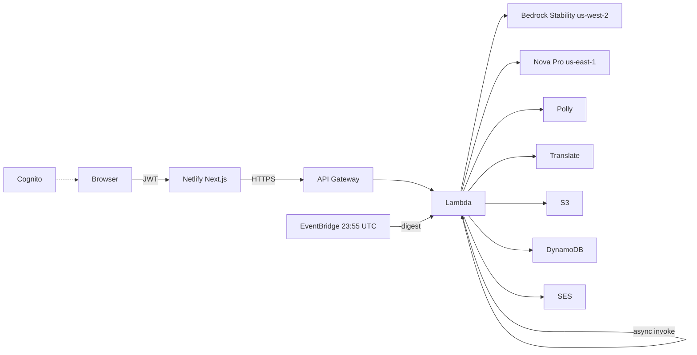

# Infinite Mashup Studio

AWS Builder Center **Weekend Creative Challenge** — `#creative-expression`

Live app: [infinite-mashup-studio.netlify.app](https://infinite-mashup-studio.netlify.app)

Fuse API: [API Gateway (us-east-1)](https://1gp21rrv70.execute-api.us-east-1.amazonaws.com)

Choose catalog ingredients (daily locked trio, or sandbox plus optional photos). Fuse invents one subject: a generated illustration, an eight-register dossier bound to that image, and spoken origin audio. Sign-in required. Galleries are private per Cognito account. Ten fuses per UTC day.

## What it produces

- Cinematic PNG of a single fused creature, object, or concept (Stability on Bedrock in **us-west-2**: Ultra → SD 3.5 Large → Core)
- Dossier from **Amazon Nova Pro** with that PNG in the Converse payload: origin, abilities, personality, fun facts, advertisement, warning, classification, mock patent
- Origin MP3 (**Amazon Polly**, neural Ruth)
- Optional dossier localization (**Amazon Translate**)
- Remix as a new job, not an in-place edit

## Architecture

Two planes. The browser never holds Bedrock credentials.

```text
Browser + Cognito JWT
  -> Netlify (Next.js 15) /api/*
  -> API Gateway HTTP API
  -> Lambda start_job  (JOB#PENDING, Invoke Event)
  -> Lambda worker ~180s
       -> Bedrock us-west-2  Stability PNG
       -> Bedrock us-east-1  Nova Pro (PNG -> JSON)
       -> Polly, Translate
       -> S3  mashups/{id}.png|.mp3|.json
       -> DynamoDB  MASHUP# + GSIs
EventBridge 23:55 UTC -> digest via SES
```



Full diagram: [`article-assets/infinite-mashup-studio-full-architecture.png`](article-assets/infinite-mashup-studio-full-architecture.png)

**Indexes:** `DATE#{UTC}` (Today), `DATE#ALL`, `USER#{sub}` (gallery + quota). Sandbox still uses the UTC date partition; `mode` is an attribute.

**Auth:** Cognito email pool, `USER_PASSWORD_AUTH`. Unsigned visitors see login only. Sign-out returns to login.

## Stack

| Piece | Choice |
|---|---|
| UI | Next.js 15, TypeScript, Tailwind, Framer Motion on **Netlify** |
| API | API Gateway HTTP API + Python 3.12 Lambda (`infinite-mashup-fuse`) |
| Infra | SAM / CloudFormation stack `infinite-mashup-studio` **us-east-1** |
| Image | Bedrock Stability **us-west-2** (Nova Canvas / Titan Image are not used — blocked/EOL on this account) |
| Story | Nova Pro Converse + PNG |
| Data | DynamoDB + S3 |
| Identity | Cognito |
| Mail | SES + EventBridge digest |

## Local UI

```bash
cp env.example .env.local
npm install
npm run dev
```

`FUSE_API_URL` must be the API Gateway origin with no path. Cognito IDs are in `env.example` / `netlify.toml`.

## SAM

```bash
sam build --template-file infra/template.yaml
sam deploy --stack-name infinite-mashup-studio --region us-east-1 \
  --parameter-overrides AppUrl=https://infinite-mashup-studio.netlify.app MailFrom=YOUR_VERIFIED_SES_FROM
```

Enable Bedrock model access for Nova Pro (us-east-1) and Stability image models (us-west-2). Fuse is 30–90s; the UI polls `/jobs/{id}`.

SES From a Gmail address will fail Gmail DMARC. Use a domain with SPF/DKIM for inbox mail. Browser notifications still fire on complete.

## Challenge article

See [`ARTICLE.md`](ARTICLE.md).
