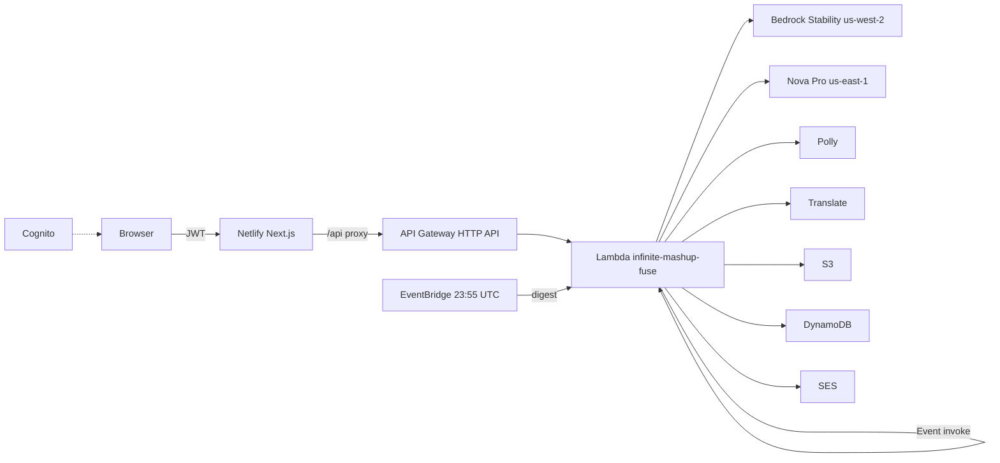

# Infinite Mashup Studio

Generative studio for the AWS Builder Center Weekend Creative Challenge (`#creative-expression`).

You compose ingredients. Fuse returns one invented subject: a real generated illustration, a dossier written from that image, and spoken origin audio.

**App:** https://infinite-mashup-studio.netlify.app  
**Repo:** https://github.com/sivaabishikth2025-byte/infinite-mashup-studio  
**API:** https://1gp21rrv70.execute-api.us-east-1.amazonaws.com  

## Product

| Mode | Input |
|---|---|
| Daily | Three catalog chips locked from the UTC date seed; up to two extra chips |
| Sandbox | Two to five catalog chips; optional camera and/or upload (max two photos) |

**Output of a completed fuse**

- PNG illustration of a single fused creature, object, or concept
- Dossier: origin, abilities, personality, fun facts, advertisement, warning label, scientific classification, mock patent
- MP3 of the origin (Polly)
- Optional translated dossier (same image)
- Remix starts a new job

**Accounts**

Cognito email sign-in is required. Studio, Gallery, and Profile are hidden until you are signed in. Gallery and the daily cap are scoped to `sub` (private). **10 fuses per UTC day**, counted from that account’s mashup rows. Sign-out returns to the login panel. Browser notifications fire when a job completes. SES can send ready-mail and a 23:55 UTC digest if From is a verified identity (Gmail-as-From fails DMARC).

## How a fuse runs

Generation does not fit in a synchronous API Gateway timeout. The contract is a job.

1. `POST /fuse` — validate catalog IDs, write `JOB#PENDING`, invoke the same Lambda with `InvocationType=Event`, return `jobId`
2. Worker — Stability PNG (us-west-2) → Nova Pro Converse with that PNG (us-east-1) → Polly MP3 → S3 `mashups/{id}.png|.mp3|.json` → DynamoDB `MASHUP#` + GSIs → `JOB#COMPLETE`
3. Browser polls `GET /jobs/{id}` then opens `/m/{id}`

Sandbox photos are stored at `jobs/{jobId}/photo-N.jpg` and condition image generation. They are not published as the mashup.



## What is actually in production

| Layer | What we use |
|---|---|
| UI | Next.js 15, TypeScript, Tailwind, Framer Motion |
| Host | **Netlify** (`@netlify/plugin-nextjs`), site `infinite-mashup-studio` |
| Auth | Amazon Cognito user pool `us-east-1_QU5aLbg93`, client `7gj8bb4n43d55k0uon01dedt9m`, `USER_PASSWORD_AUTH` |
| API | API Gateway HTTP API → Lambda `infinite-mashup-fuse` (Python 3.12, 180s, 1024 MB) |
| Infra | SAM / CloudFormation stack **`infinite-mashup-studio`**, **us-east-1**, account `120569623789` |
| Image | Bedrock **us-west-2**: `stability.stable-image-ultra-v1:1` → `stability.sd3-5-large-v1:0` → `stability.stable-image-core-v1:1` |
| Dossier | Bedrock **us-east-1** Nova Pro `amazon.nova-pro-v1:0` (`converse`, PNG in the user message) |
| Speech | Amazon Polly, neural Ruth |
| Locale | Amazon Translate |
| Objects | S3 `infinite-mashup-studio-mashupbucket-qtdt6ib5v7de` (`mashups/*` GetObject is public) |
| State | DynamoDB `infinite-mashup-studio-MashupTable-IE2CZLX7ILOC` |
| Mail | Amazon SES + EventBridge `cron(55 23 * * ? *)` |

**Not in the live image path:** Nova Canvas, Titan Image (blocked / EOL on this account). `IMAGE_MODEL_ID` in SAM still defaults to Canvas; the worker uses Stability in us-west-2 instead. Gemini image is a last-resort key in SAM, not the production path (credits 429). **Not used:** CloudFront, Amplify (UI left Amplify after `FUSE_API_URL` failed to inject). There is no public global gallery.

**DynamoDB**

| Key | Use |
|---|---|
| `pk` | `MASHUP#{uuid}` / `JOB#{id}` |
| `gsi1` `DATE#{YYYY-MM-DD}` | Today (sandbox uses the UTC date, not `DATE#sandbox`) |
| `gsi2` `DATE#ALL` | ordered all-time (not a public feed) |
| `gsi3` `USER#{sub}` | private gallery and daily fuse count |

## API

| Method | Path |
|---|---|
| POST | `/fuse` |
| GET | `/jobs/{id}` |
| GET / DELETE | `/mashups/{id}` |
| GET | `/gallery` (signed-in, `mine`) |
| GET | `/quota` |
| GET | `/translate` |

The Next.js app proxies these under `/api/*`. Tokens: `Authorization`, `x-ims-access`, `x-id-token`.

## Run the UI locally

```bash
cp env.example .env.local
npm install
npm run dev
```

`env.example` already points at the deployed API and Cognito pool. `FUSE_API_URL` must be the API origin with no path.

## Deploy the SAM stack

Bedrock model access: Nova Pro in **us-east-1**, Stability image models in **us-west-2**.

```bash
sam build --template-file infra/template.yaml
sam deploy --stack-name infinite-mashup-studio --region us-east-1 \
  --parameter-overrides AppUrl=https://infinite-mashup-studio.netlify.app MailFrom=VERIFIED_SES_FROM
```

Netlify env (also in `netlify.toml`): `FUSE_API_URL`, `NEXT_PUBLIC_FUSE_API_URL`, `NEXT_PUBLIC_APP_URL`, Cognito pool / client / region.
